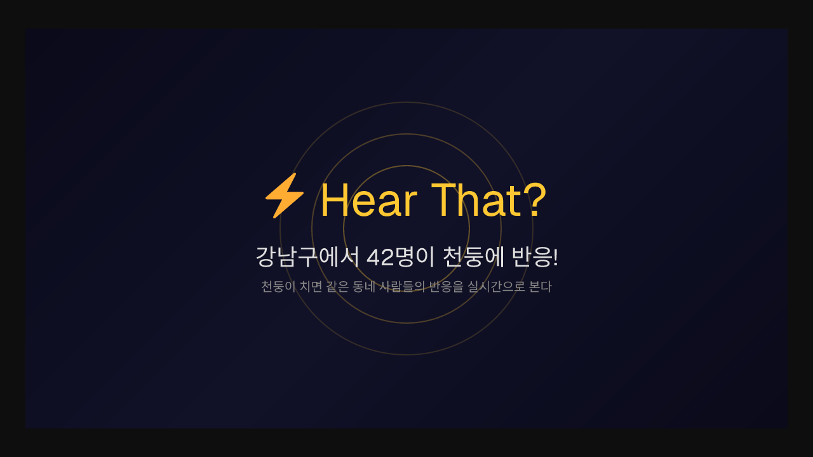

# Hear That? ⚡

천둥이 치면 같은 동네 사람들의 반응을 실시간으로 본다.



## Live

https://hear-that.vercel.app

## Features

- **실시간 반응**: 이모지 5종(⚡😱🙉😂🌧️) 원탭 + 텍스트 입력
- **Thunder Wave**: 번개 지점에서 343m/s 음속으로 퍼지는 동심원 애니메이션
- **기상청 연동**: 낙뢰위치정보 API 1분 자동 폴링, 전국 번개 실시간 표시
- **클러스터링**: 줌아웃 시 숫자 원, 줌인 시 개별 이모지 (당근마켓 스타일)
- **지역 채팅**: 같은 동네(H3 hex ~9km) 사람들끼리 실시간 대화
- **번개 클릭**: 낙뢰 위치 역지오코딩 팝업 (지역명 + 시간)
- **번개 이동**: "전국에서 번개 N건 감지" 배너 클릭 시 번개 위치로 flyTo
- **닉네임**: "번개맞은 고양이", "졸린 펭귄" 등 랜덤 닉네임
- **내 반응 구분**: 골드 배경 + "나" 뱃지
- **모바일**: 반응형 하단 시트 (3단계 스와이프)
- **PWA**: standalone 모드, 홈 화면 추가
- **공유**: 동적 OG 이미지 + Web Share API

## Architecture

```
[Browser] ←WebSocket→ [Supabase Realtime]
    ↓                        ↓
[Mapbox GL]           [Postgres]
    ↓                        ↑
[Wave Animation]      [기상청 API] (1분 폴링)
    ↓
[H3 Clustering]
```

## Tech Stack

| Layer | Tech |
|-------|------|
| Frontend | Next.js 16 (App Router) + TypeScript + Tailwind CSS |
| Backend | Supabase (Postgres + Realtime + Edge Functions) |
| Map | Mapbox GL JS + H3 (geo-bucketing) |
| Weather | 기상청 낙뢰관측자료 조회서비스 (getLgt) |
| Deploy | Vercel |

## Setup

```bash
bun install
cp .env.local.example .env.local
# .env.local에 키 입력
bun dev
```

## Environment Variables

| Key | Description | Where to get |
|-----|-------------|-------------|
| `NEXT_PUBLIC_SUPABASE_URL` | Supabase project URL | supabase.com |
| `NEXT_PUBLIC_SUPABASE_ANON_KEY` | Supabase anon key | supabase.com |
| `SUPABASE_SERVICE_ROLE_KEY` | Supabase service role key | supabase.com |
| `NEXT_PUBLIC_MAPBOX_TOKEN` | Mapbox access token | mapbox.com |
| `KMA_API_KEY` | 기상청 Open API key | data.go.kr |

## Database Schema

```sql
-- 반응
reactions (id, lat, lng, emoji, text, created_at, h3_index, device_uuid)

-- 날씨 이벤트
weather_events (id, lat, lng, type, source, created_at, h3_index)

-- 채팅
chats (id, text, h3_index, device_uuid, created_at)
```

## License

MIT
